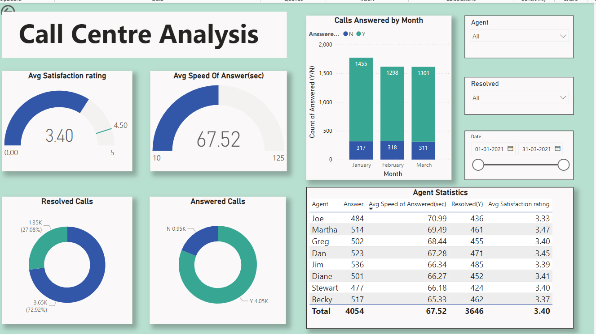
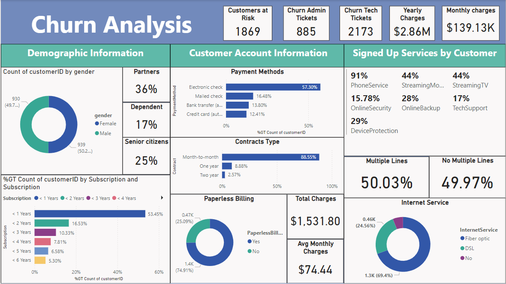
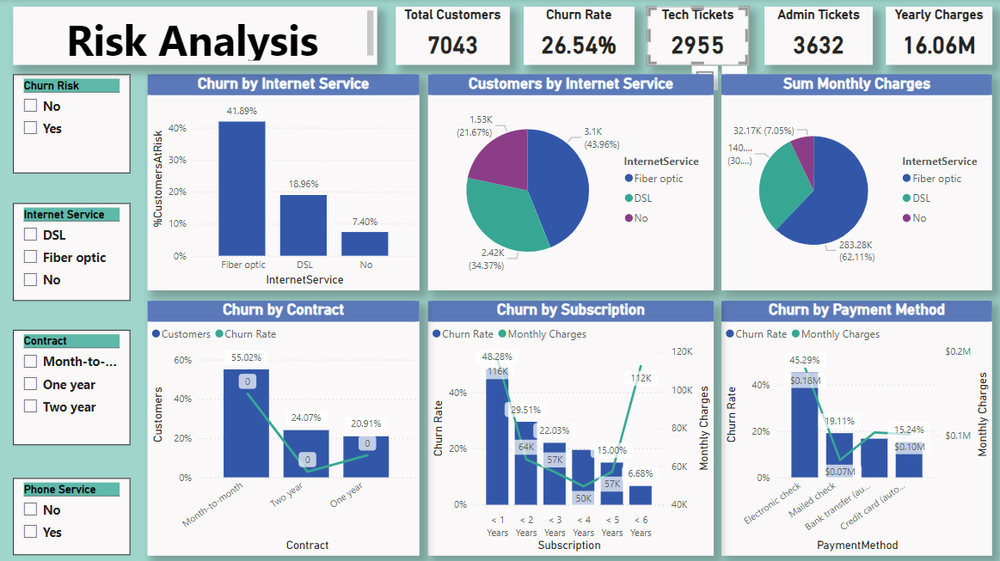

# Call-Centre-Customer-Insights
Project analyzes two critical areas of analysis for Call centre, call centre performance and customer retention.

## Problem Statement

This project addresses two critical areas of a telecom company's operations: 

1. **Call Centre Performance**: The call centre is a vital part of customer experience and satisfaction. The challenge is to evaluate key performance indicators (KPIs) to improve service quality, response times, and agent performance.
  
2. **Customer Retention**: Telecom companies face a high churn rate, which means they are losing customers at a significant rate. The company needs a better understanding of factors contributing to customer churn and predictive measures to retain customers before they leave.

## Project Overview

This repository contains dashboards created using **Power BI** to analyze and visualize trends related to the **Call Centre performance** and **Customer Retention**.

### Dashboards:
- **Call Centre Trends Analysis**: Provides insights into key performance metrics such as customer satisfaction, call answer/abandonment rates, call resolution, and agent performance.
- **Customer Retention Analysis**: Focuses on identifying factors contributing to customer churn and visualizing trends such as churn by internet service, churn by contract, and payment method.

## Data Analysis Process

### Call Centre Analysis

1. **KPIs Calculated**:
    - **Overall Customer Satisfaction**: Average rating of customer feedback.
    - **Calls Answered/Abandoned**: Monthly comparison of answered versus abandoned calls.
    - **Average Speed of Answer**: The average time taken for agents to answer customer calls.
    - **Agent Performance**: Evaluated based on average speed of answer, number of resolved cases, and satisfaction rating.
  
2. **Key Insights**:
    - **Customer Satisfaction**: The average customer satisfaction rating is **3.40/5**, indicating room for improvement.
    - **Call Answer Rates**: There was a consistent number of calls answered monthly (~4,000), but abandoned calls need attention.
    - **Agent Efficiency**: Agents showed varying performance, with some agents named Joe and Martha, resolving more calls with higher customer satisfaction.

3. **Actionable Recommendations**:
    - **Optimize Call Handling**: Reduce the average speed of answer to improve customer experience, with current average speed being 67.52 seconds.
    - **Focus on Agent Training**: Provide tailored training to agents with lower performance in terms of speed and satisfaction ratings.
    - **Automated Responses**: For commonly abandoned call issues, introduce an automated system to engage customers before they abandon the call.

### Customer Retention Analysis

  

### Risk Analysis Dashboard

1. **KPIs Calculated**:
    - **Churn Rate**: Overall churn rate is calculated at **26.54%**, highlighting significant customer losses.
    - **Churn by Internet Service**: Customers with fiber optic services have a higher churn rate (41.89%) compared to DSL (18.96%).
    - **Churn by Contract Type**: Month-to-month contracts have the highest churn rate (55.02%), while customers with longer-term contracts have lower churn rates.

2. **Key Insights**:
    - **Churn by Payment Method**: Customers using electronic checks have a higher churn rate (45.29%) compared to other payment methods like credit cards or bank transfers.
    - **Churn by Subscription Length**: Customers subscribed for less than 1 year are most likely to churn, with a churn rate of 48.28%.

3. **Actionable Recommendations**:
    - **Proactive Retention Strategies**: Implement proactive outreach for customers on month-to-month contracts and electronic check payment methods to offer incentives or contract upgrades.
    - **Analyze Fiber Optic Service**: Investigate why fiber optic customers are more likely to churn and improve service quality or pricing for this group.
    - **Focus on Long-Term Contracts**: Encourage long-term contracts through loyalty programs, as they result in lower churn rates.

## Insights and Benefits

These analyses and visualizations provide a clear understanding of the call centre's performance and customer churn patterns. The actionable insights are designed to improve both customer service quality and retention efforts, ultimately leading to better customer satisfaction and reduced churn.

---

## Future Work

- **Predictive Modeling**: Implement predictive models for customer churn to identify at-risk customers before they leave.
- **Enhanced Segmentation**: Segment customer groups by demographic data to target retention strategies more effectively.
- **Integration with CRM**: Integrate dashboards with the company’s CRM system to get real-time updates on customer satisfaction and churn.

---

## Conclusion

This project provides a comprehensive analysis of the telecom company’s customer service and retention metrics. The recommendations provided will assist management in making data-driven decisions to enhance service quality and customer loyalty.

